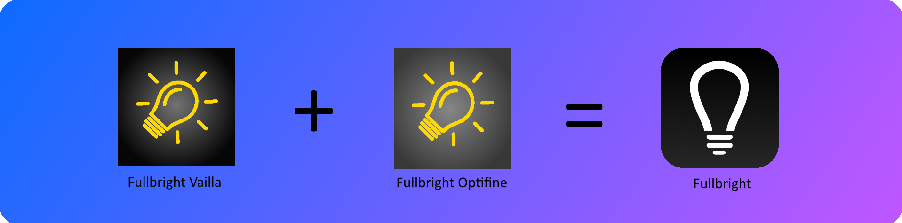
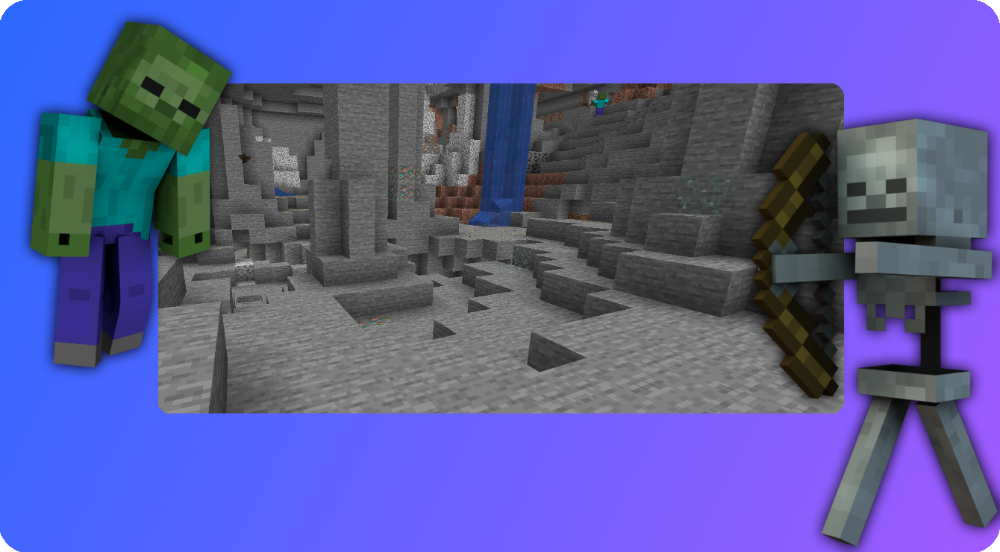

##

You are welcome to look at our code, do not pass off the texture pack as your own. 
as this pack is unique with its capabilities that it runs on two versions.

Ultra bright is the Fullbright Vanilla Peck and the Optifine Pack in one.
Is currently available in Minecraft version 1.19.

## Vallia and Optifine Fullbright is now a pack.

With Fulbright you can now dare to go into caves again They are now bright so bright that you see everything really everything.

## What is Fullbeight ?

Fullbright turns night into day, seeing more in caves and the landscape.

Now there is an end to putting torches in the heights or even sleeping because it is too dark this you can change now this Fullbight works for Vanilla and Optifine.

